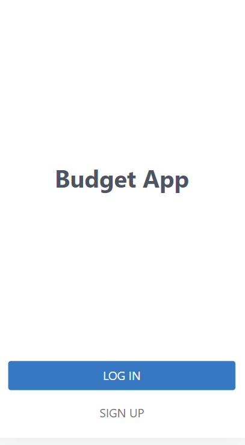

# Budget App

> The Budget app is a mobile web application where you can manage your budget: you have a list of transactions associated with a category, so that you can see how much money you spent and on what.

## Live Demo

[Live Demo Link](https://arcane-woodland-30814.herokuapp.com/)

## Website ScreenShot

## Database Schema

## Built With

- Ruby
- Ruby on Rails
- OOP
- SQL Postgres

## Getting Started

To get a local copy up and running follow these simple example steps.

- Click on the top right green "code" button.
- On the dropdown menu, choose "download with zip" button.
- After download, extract the zip file and you have the project on your machine.
- Make sure that your PostgreSQL server is running and you have the ability to establish connection with the database.
- Create a new file called `local_env.yml` in the folder `config/` and paste the following code in it:
  > `PG_USERNAME: "YourPostgresUsername"`  `PG_PASSWORD: "YourPostgresPassword"`   `GMAIL_USERNAME: "YourGmailSenderUsername"`  `GMAIL_PASS: "YourGmailSenderPassword"` 
  > Note:  You can use your own gmail account to send emails but first you have to configure 2-Step Authorization and after that you have to configure
  > an APP Password for this specific application. If you want more information about this, GOOGLE IT.
- Execute `rails db:create` to create the database.
- Run `rails s` to run the application.

## Tests

- If you want to run some unit tests, all you need to do is:
- On your terminal execute:
  > `gem install rspec`
- Run the `rspec` command in this case over the path of `spec/`, the resulting command will look like this:
  > `rspec spec/`
- If you want to run the tests over the entire project, you can execute the following command:
  > `rspec`

## Author

👤 **George Magdy**

- GitHub: [@George_Magdy](https://github.com/gemmen29)
- Twitter: [@George_Magdy](https://twitter.com/georgtriple1)
- LinkedIn: [@George_Magdy](https://www.linkedin.com/in/george-magdy-840/)

## 🤝 Contributing

Contributions, issues, and feature requests are welcome!
Feel free to check the [issues page](../../issues/).

## Show your support

Give a ⭐️ if you like this project!

## Acknowledgments

- Inspired by [Gregoire Vella](https://www.behance.net/gregoirevella)

## 📝 License

This project is [MIT](./MIT.md) licensed.
